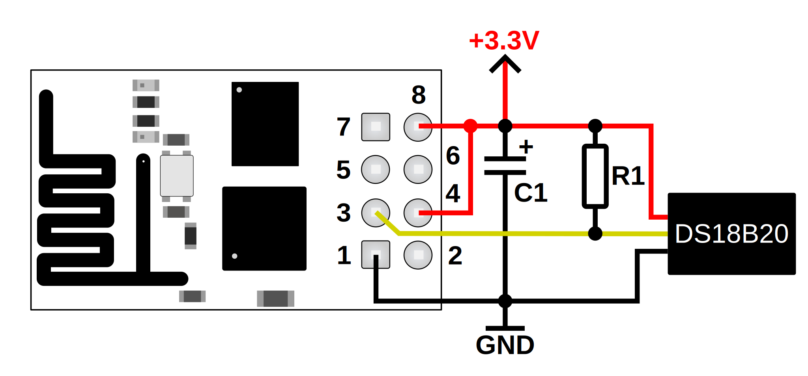

# ESP8266 Temperature sensor
This is a quick and dirty project for measuring temperatures with an ESP8266 Wifi module (ESP-01) and a DS18B20 temperature sensor, and sending the measured values to an Influx database (InfluxDB v2).

This project is not recommended for industrial use or in places where the measured values has critical significances, because the payload sent by the module is not encrypted and in case of a missing network the measured values are not stored, it can only work in real-time. It can be only used for experimental purposes.

## The circuit


The ESP-01 module is powered from a 3.3V power source. On the power rails there is a C1 capacitor which is a tantalum capacitor. This capacitor is need to be mounted really close to the ESP-01 and the capacitance should be at least 22uF, and the voltage should be at least 6.3V. This capacitor is placed there to provide enough enegy when the ESP-01 module is transmitting and causes large current spikes on the power rails. Pin 4 of the ESP-01 module also need to be connected to the 3.3V power source.

The DS18B20 temperature sensor's VCC, and GND is connected to the ESP-01 module's VCC, and GND, so the sensor is workingfrom the same power supply as the ESP-01 module. The DS18B20 sensor's signal wire (yellow wire) is connected to the ESP-01 module's 3rd pin which is the GPIO2 pin, with an R1 pull-up resistor. The R1 pull-up resistor's value can be 2.2kOhm to 4.7kOhm.

## Setting up the Arduino IDE
To start working with this project you must need to install the necessary packages for the Arduino IDE. To do that, in the Arduino IDE go to the File -> Preferences... and in the "Additional boards manager URLs" insert this string:
```
https://dl.espressif.com/dl/package_esp32_index.json, http://arduino.esp8266.com/stable/package_esp8266com_index.json
```
Then go to the Tools -> Board -> Boards Manager... and in the search bar, search for "esp8266". There should be an "esp8266" named package by the ESP8266 Community. Select the latest version and install it.

For handling the DS18B20 sensor, we also need a library, to get that, go to the Tools -> Manage Libraries... and in the search bar, search for "onewire". There should be a "One Wire" named library by Jim Studt, Tom Pollard and others. Select the latest version and install it.

## Configuration
Before uploading the code to the ESP-01 module, the name of the module and the Wifi network details, and other parameters are needs to be set. These settings are in the config.hpp file.
```
#define STASSID       "<Wifi_SSID>"
#define STAPSK        "<Wifi_password>"

#define MUNIT         "<Unit_name>" 

#define DBIP          "<Database_IP_address>"
#define DBPORT        "<Database_PORT>"

#define ORGID         "<Organization_ID>"
#define TOKEN         "<Token>"
#define BUCKET        "<Bucket_name>"
#define MEASUREMENT   "<Measurement_name>"
```

## Programming the ESP module
For programming the ESP-01 module, in the Arduino IDE go to the Tools -> Board -> esp8266 and select the "Generic ESP8266 Module". Then connect the ESP-01 module to a USB-UART adapter the same way as on the following picture.


The pin 5 of the ESP-01 has to be connected to the ground, and pin 4 has to be connected to the 3.3V power source.

Connect the USB-UART adapter's TX wire to the ESP-01 7th pin (GPIO3/U0RXD), and connect the adapter's RX wire to the ESP-01 2nd pin (GPIO1/U0TXD).

Then power up the ESP-01 module, and connect the USB-UART adapter to the USB port.

After everything is connected, in the Arduino IDE, go to the Tools -> Port and select the USB-UART adapter's port, then click to the upload button on the toolbar.

If everything was set up correctly, the Arduino IDE should compile the code and upload it to the ESP-01.

After the upload is finished, disconnect the ESP-01 module's 5th pin from the ground, and restart the ESP-01 module.

## ESP-01 pinout
| Pin number | Function    |
|------------|-------------|
| 1          | GND         |
| 2          | GPIO1/U0TXD |
| 3          | GPIO2       |
| 4          | Ch_PD       |
| 5          | GPIO0       |
| 6          | Reset       |
| 7          | GPIO3/U0RXD |
| 8          | VCC         |

